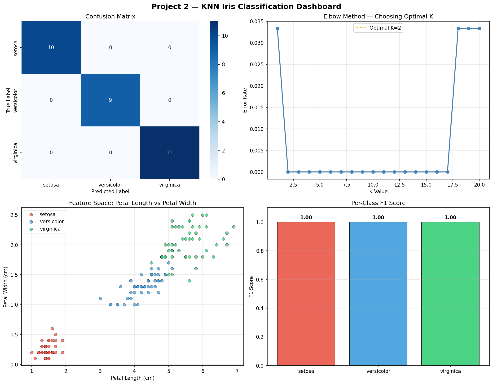

#  Project 2 — Data Classification Using AI (KNN)

> **DecodeLabs Industrial Training Kit | Batch 2026**

---

## 📌 Overview

This project implements a **K-Nearest Neighbors (KNN)** classifier on the classic **Iris dataset** to predict the species of a flower based on its physical measurements. It covers the complete supervised learning pipeline — from raw data to validated output.

---

## 🧠 Concepts Covered

| Concept | Description |
|---|---|
| Supervised Learning | Machine learns from labeled historical data |
| Feature Scaling | StandardScaler (Mean=0, Variance=1) |
| Train-Test Split | 80% training / 20% testing with shuffle |
| KNN Algorithm | Proximity principle — majority vote of K neighbors |
| Elbow Method | Finding optimal K by minimizing error rate |
| Confusion Matrix | TP, FP, FN, TN breakdown |
| F1 Score | Harmonic mean of Precision and Recall |

---

## 📊 Dataset — Iris Benchmark

- **Samples:** 150 (balanced — 50 per class)
- **Classes:** 3 → Setosa, Versicolor, Virginica
- **Features:** 4 → Sepal Length, Sepal Width, Petal Length, Petal Width

---

## 🔁 Project Pipeline (IPO Framework)

```
INPUT                  PROCESS                 OUTPUT
──────                 ───────                 ──────
Iris Dataset      →    Train-Test Split    →   Confusion Matrix
Feature Scaling        KNN Algorithm           F1 Score
```

---

## 🚀 How to Run

```bash
# 1. Clone the repository
git clone https://github.com/YOUR_USERNAME/decodelabs-ai-project2.git
cd decodelabs-ai-project2

# 2. Install dependencies
pip install -r requirements.txt

# 3. Run the project
python iris_classification.py
```

---

## 📦 Requirements

```
numpy
pandas
matplotlib
seaborn
scikit-learn
```

---

## 📈 Results

| Metric | Score |
|---|---|
| Accuracy | **100%** |
| F1 Score (Weighted) | **1.0000** |
| Optimal K | **2** |

---

## 📂 Project Structure

```
decodelabs-ai-project2/
├── iris_classification.py   # Main script
├── knn_dashboard.png        # Output visualizations
├── requirements.txt         # Dependencies
└── README.md                # This file
```

---

## 📊 Output Dashboard



---

## 🏢 About

**DecodeLabs** | Greater Lucknow, India
📧 decodelabs.tech@gmail.com | 🌐 www.decodelabs.tech
